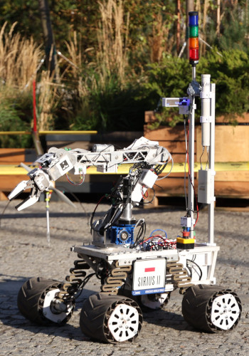
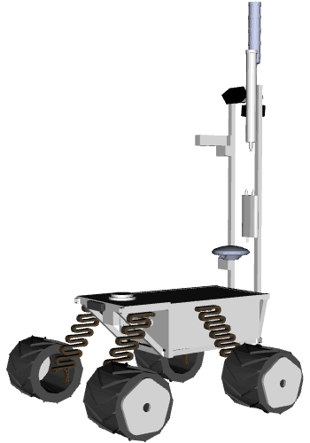
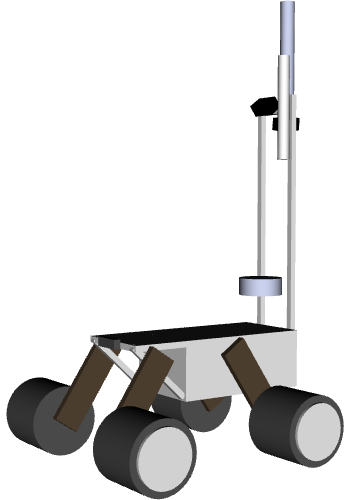

# sirius_description package
Description of the Sirius hardware. Package provides:
- Urdf (xacro) models of the rover

## URDF
- `sirius.urdf.xacro`  
    Sirius 2 model  
    In order to generate urdf file run:
    ```bash
    $ roscd sirius_description/urdf/
    $ xacro sirius.urdf.xacro -o sirius.urdf
    ```
|  |  |  |
|---------------------------------------|----------------------------------------------|-------------------------------------------------|
| Sirius II                             | Model wizualny                               | Model kolizyjny                                 |

